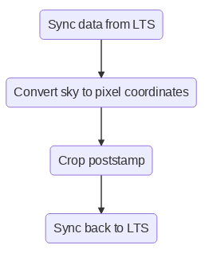

# Example HPC workflow at Pawsey using LTS

LTS is the future [Pawsey][pawsey] storage system based on [Red Hat Ceph Object Store][ceph].

This is an example workflow of an HPC workflow that takes an astronomical image (fits with WCS) from LTS, finds out the pixel coordinates based on sky coordinates, and returns the post stamp to LTS. 

The execution diagram looks like so:



To schedule the scripts you need to run:

`./schedule.sh files.txt`

This is an example workflow that only processes one file and there is no special script to run if there is an error somewhere, but once understood the user can easily make those additions. Please contact Pawsey support if you require help with these.

## Prerequisites

This is assuming that you have your data on S3/Ceph (see the script for details) at Pawsey, that you have `$MYSCRATCH` set in your environment (default at Pawsey) and you set two environment variable containing your credentials when you submit the jobs to the cluster:

```
export RCLONE_CONFIG_CEPH_ACCESS_KEY_ID="deadbeefdeadbeefdeadbeef"
export RCLONE_CONFIG_CEPH_SECRET_ACCESS_KEY="deadbeefdeadbeefdeadbeef"
```
Finally slurm federation needs to be enabled.


[pawsey]: https://pawsey.org.au 
[ceph]: https://docs.ceph.com/en/latest/radosgw/