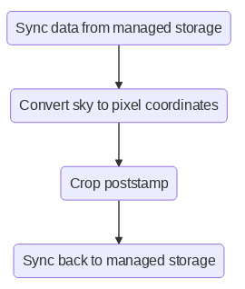

# Example HPC workflow at Pawsey using LTS

LTS is the future [Pawsey][pawsey] storage system based on [Red Hat Ceph Object Store][ceph].

This is an example workflow of an HPC workflow that takes an astronomical image (fots with wcs) from LTS, finds out the pixel coordinates based on skycoordinates and returns the post stamp to LTS. 

The excution diagram looks like so:

In order to schedule the scripts you need to run:

`./schedule.sh files.txt`

[pawsey]: https://pawsey.org.au 
[ceph]: https://docs.ceph.com/en/latest/radosgw/